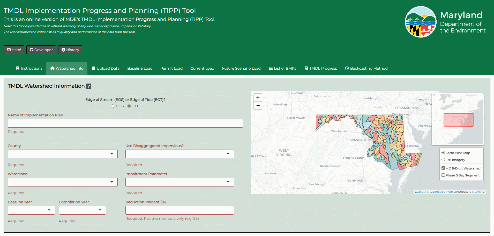
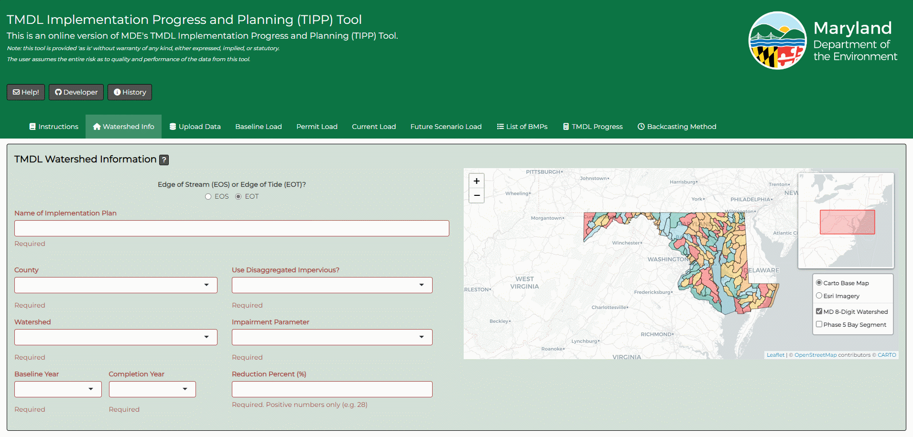
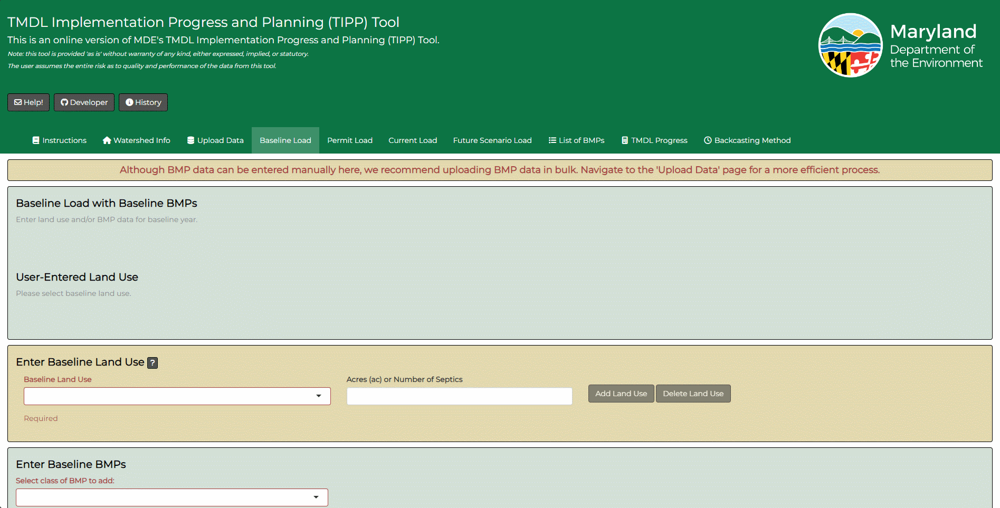
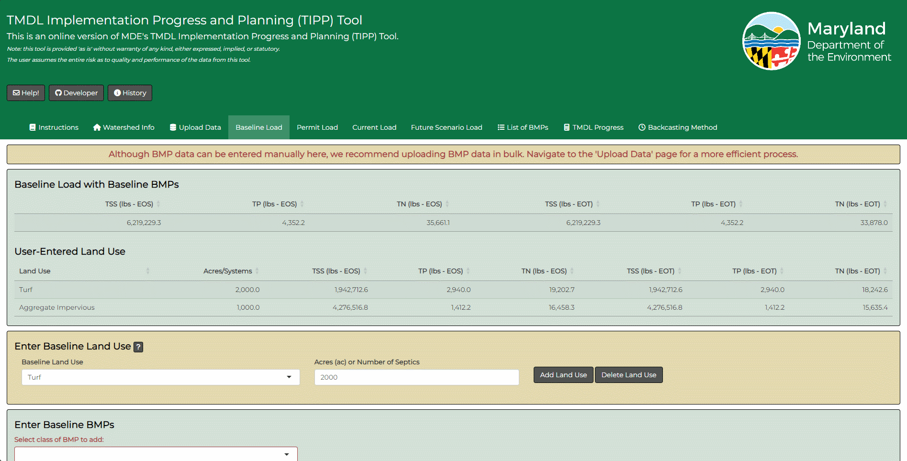
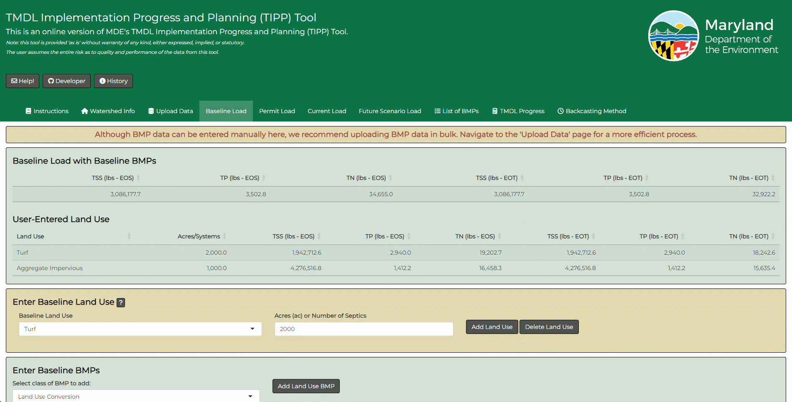
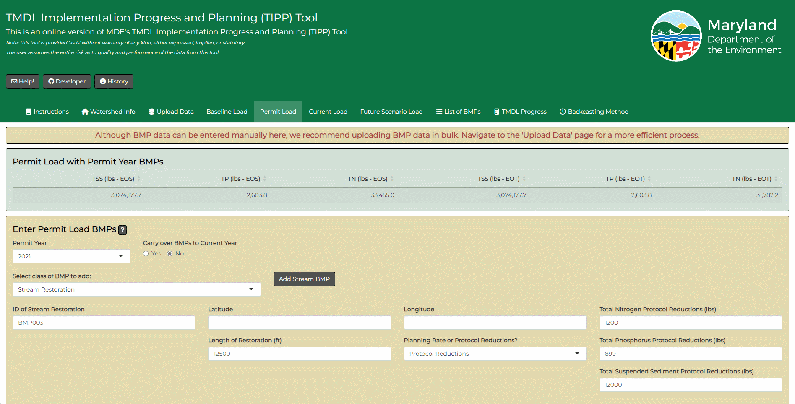
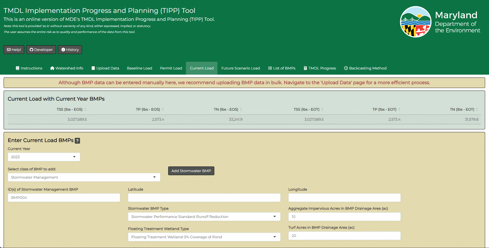
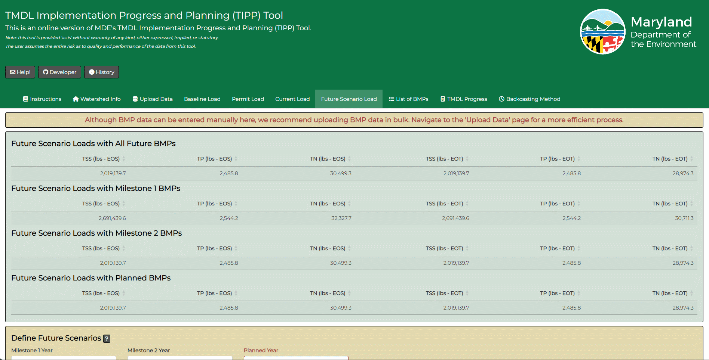
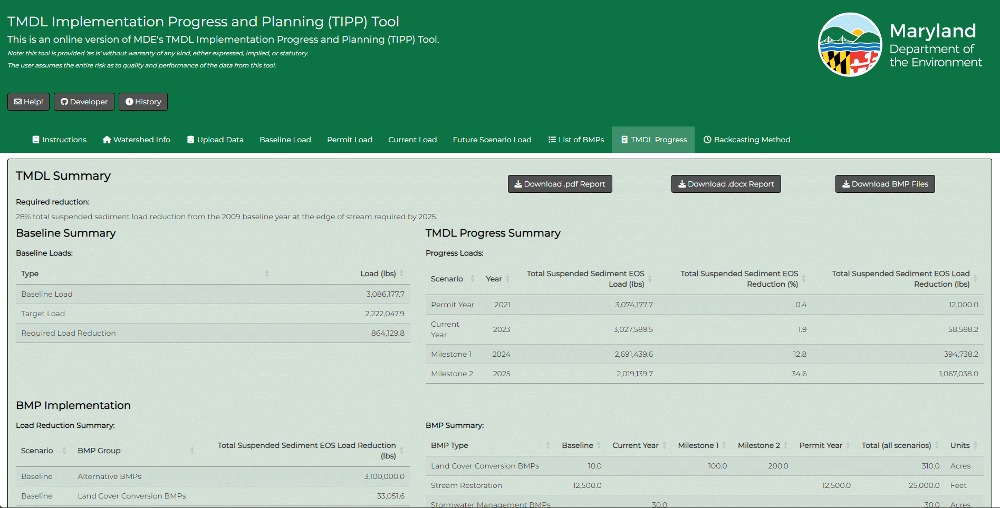

# Introduction

In 2023, the Maryland Department of the Environment (MDE) introduced the TMDL Implementation Progress and Planning (TIPP) Tool. The tool can be viewed <a href="https://mddepartmentoftheenvironment.shinyapps.io/TIPP-Model-Maryland/" target="_blank">here</a>. Its primary purpose is to help local jurisdictions evaluate their progress and adherence to local Total Maximum Daily Loads (TMDLs) via Best Management Practice (BMP) implementation. The TIPP Tool is an online adaptation of the original Microsoft Excel spreadsheet created by MDE. The online tool incorporates a centralized version control system, ensuring that users access the most up-to-date version when logging into the site. To see the development history of the tool, the user can click the 'History button' at the top of the tool:   

  
    
   
The tool is provided 'as is' without warranty of any kind, either expressed, implied, or statutory. The user assumes the entire risk as to quality and performance of the data from this tool. To learn more about TMDLs in Maryland, please visit <a href="https://mde.maryland.gov/programs/water/TMDL" target="_blank">https://mde.maryland.gov/programs/water/TMDL</a>. To contact the developer of this online tool, please visit <a href="https://github.com/joshuajdthompson" target="_blank">https://github.com/joshuajdthompson</a>. To contact MDE for assistance, click on the 'Help!' button which will copy the email address of MDE's TMDL coordinator to your clipboard. 

# Using the tool

The following sections will document the proper usage of the tool. Please note:

- Refreshing the browser at any point will result in the loss of all your progress.
- If you remain idle for an extended period, you will be automatically disconnected from the server, leading to data loss. 

**Remember to safeguard your progress by clicking the ‘Download BMP Files’ button on the ‘TMDL Progress’ page if the user anticipates a break in progress.** Throughout the tool, there will be various question mark buttons which, when clicked, will reveal pertinent information and helpful hints about the various fields that need to be populated. 

There are two primary methods for using the tool:

1. Manually input land use and BMP data by filling in the required fields on the ‘Baseline Load’, ‘Permit Load’, ‘Current Load’, and ‘Future Scenario Load’ pages. 
2. Streamline the process by visiting the ‘Upload Data’ page, where you can upload land use and BMP data in bulk. 

Detailed instructions for both approaches are provided below.

## Home Page 

On the 'Home' page, you'll find essential inputs and a map. This map offers two base layers: a Carto Base Map and Esri orthoimagery. You can easily switch between these base layers using the radio buttons in the map widget. Additionally, the map includes two polygon layers: MD 8-Digit watersheds and Phase 5 Bay segments. To show or hide these polygons, simply use the check boxes in the map widget. When you select these features by clicking on the polygons in the map, a popup will display identifying information.

To input data on the ‘Home’ page, follow these steps:

1. Determine the assessment scale using the radio buttons under ‘Edge of Stream (EOS) or Edge of Tide (EOT)?’ It is essential to consult the TMDL documentation to ensure you select the correct assessment scale, as this choice influences whether delivery ratios are applied to BMP reductions.
2. Provide the plan’s title, choose the County where the TMDL is located from the dropdown menu, and then select the watershed for TMDL progress assessment. The available watershed options will be filtered to show only those within the chosen County. The map will automatically highlight and zoom in on the selected watershed for your verification.
3. Set both the baseline and completion years, ensuring that the completion year is later than the baseline year. 
    * Baseline year is defined as the baseline year of the TMDL.
    * Completion year is defined as the estimated year to meet the TMDL reduction target.
4. Specify whether impervious roads and impervious non-roads land cover will be aggregated or not, choose the impairment parameter, and define the required TMDL reduction percentage. 

You can refer to the example animation illustrating these steps below.

 

    

   

**Summary: Before using the tool, all information on the 'Home' page should be completed. Take special care to ensure that all information is accurately entered, and in particular, that the entered completion year is after baseline year.**

## Upload Data 

You have two options for inputting data: manual entry or bulk upload. **Regardless of your choice, it's crucial to ensure that all required information is entered on the 'Home' page before proceeding with data entry or bulk uploads.**

For bulk uploads, please note:

- Data must follow a specific format; otherwise, the tool may not function correctly. To assist users, there is an option to download an example file by clicking the ‘Download Example Input’ button. You can review this file to understand the required data structure before uploading your custom file. 
- After you’ve uploaded your data, you can navigate through the ‘Baseline Load’, ‘Permit Load’, ‘Current Load’, ‘Future Scenario Load’, ‘List of BMPs’, and ‘TMDL Progress’ pages to review the uploaded data and assess TMDL compliance. 

You can find an example of the data upload process in the animation below.

 

    

  

## Baseline Load

If you choose to upload data directly, there’s no need to manually enter anything on the ‘Baseline Load’ page. In this case, you can skip ahead to the ‘List of BMPs’ section in the documentation.

Baseline land use can be categorized as ‘Aggregate Impervious’, ‘Impervious Road’, ‘Impervious Non-Road’, ‘Turf’, or ‘Septic’. Please note that these options vary based on your response to the ‘Use Disaggregated Impervious?’ question on the ‘Home’ page. 

- If you select ‘Yes’, you’ll have ‘Impervious Road’ and ‘Impervious Non-Road’ available for selection, while ‘Aggregate Impervious’ will be unavailable. 
- If you choose ‘No’ the options will be the opposite.

This tool maintains a limitation carried over from the original Microsoft Excel spreadsheet regarding the number of allowed land use types. If you wish to account for additional land use types within your baseline load, you should add them to the ‘Turf’ land use acreage and then subtract them using a Land Cover Conversion BMP. 

- For example, if your watershed has 1000 acres of ‘Turf’ and 500 acres of ‘Tree Canopy over Aggregate Impervious’, enter 1500 acres of ‘Turf’ and add a 500-acre Land Cover Conversion BMP from ‘Turf’ to ‘Tree Canopy over Aggregate Impervious’ in the baseline scenario.

To enter baseline land use:

1. Go to the yellow section, select the land use type from the dropdown, and input the acres or the number of septics. 
2. Clicking the ‘Add Land Use’ button will add values to the table in the green section above. 
3. If you make an error in your land use input, simply select the line item in the ‘User-Entered Land Use’ table, which will be highlighted in blue when selected, and click the ‘Delete Land Use’ button in the yellow section. 

You can see an example of this process in the animation below.

 

    

  

To input baseline BMPs: 

1. Go to the green section at the bottom of the page and select the desired BMP type in the dropdown menu. Data entry fields will appear, and they will vary depending on your selection as you populate the BMP information. 
2. For each BMP, after entering the data, click the ‘Add BMP’ button to include it in the baseline scenario. 3. **Latitude and longitude fields are optional, but if left blank, BMPs will not be mapped on the TMDL Progress page.** 
4. If you make an error or need to delete a BMP at any point, you can do so by navigating to the ‘List of BMPs’ page, as described in detail in the ‘List of BMPs’ section of this documentation. 

You can view an example of how to add baseline BMPs in the animation below.

 

    

  

## Permit Load

If you prefer to upload data directly, you won’t need to manually input anything into the ‘Permit Load’ page. In this case, you can skip ahead to the ‘List of BMPs’ section in the documentation.

To input permit year BMPs:

1. Go to the yellow section at the bottom of the page and in the dropdown menu, choose ‘Permit Year’ as the year when the latest MS4 permit was issued. 
2. If the permit year matches the current Year, click ‘Yes’ under ‘Carry over BMPs to Current Year.’ This action will rename ‘Permit Year’ BMPs to ‘Permit Year/Current Year’ BMPs, eliminating the need to enter current year BMPs.
3. Select the BMP type you want to add. Data entry fields will appear, and they will adjust based on your selections as you fill in the BMP details. 
4. For each BMP, after entering the data, click the ‘Add BMP’ button to include it in the permit year scenario. 
5. **Latitude and longitude fields are optional, but if left empty, BMPs will not be mapped on the TMDL Progress page.** 
6. If you make an error or need to delete a BMP at any point, you can do so by navigating to the ‘List of BMPs’ page, as described in detail in the ‘List of BMPs’ section of this documentation. 

You can see an example of how to add permit year BMPs in the animation below.

 

    

  

## Current Load

If you prefer to upload data directly, you wont need to manually input anything into the ‘Current Load’ page. In this case, you can skip ahead to the ‘List of BMPs’ section in the documentation.

To input current year BMPs:

1. Go to the yellow section at the bottom of the page. **If you selected ‘Yes’ for ‘Carry over BMPs to Current Year’, there’s no need to separately enter current year BMPs.** Current year BMPs should encompass all BMPs in the watershed that have been implemented since the permit year.
2. Select the BMP type you wish to include. Data entry fields will appear, and they will adjust based on your selections as you fill in the BMP details. 
3. After entering the data for each BMP, click the ‘Add BMP’ button to include it in the current year scenario. 
4. **Latitude and longitude fields are optional, but if left empty, BMPs will not be on the TMDL Progress page.** 
5. If you make an error or need to delete a BMP at any point, you can do so by navigating to the ‘List of BMPs’ page, as described in detail in the ‘List of BMPs’ section of this documentation. 

You can see an example of how to add current year BMPs in the animation below.

 

    

  

## Future Scenario Load

If you prefer to upload data directly, there’s no need to manually enter anything into the ‘Future Scenario Load’ page. In this case, you can skip ahead to the ‘List of BMPs’ section in the documentation.

To input future scenario load BMPs:

1. Go to the yellow section at the bottom of the page. For ‘Milestone 1’, ‘Milestone 2’, and ‘Planned’ scenarios, the user should add the years of those scenarios. 
    * **If you do not intend to use a scenario, there’s no need to enter the year.** 
    * Future scenario load BMPs should encompass all BMPs in the watershed that are anticipated to be implemented after the current year.
2. Select the BMP type you want to include. Data entry fields will appear and will adjust based on your selections as you provide BMP details. 
3. For each BMP, after entering the data, click the ‘Add BMP’ button to include it in the future load scenario. 
4. **Latitude and longitude fields are optional, but if left empty, BMPs won’t be mapped on the TMDL Progress page.** 
5. If you make an error or need to delete a BMP at any point, you can do so by navigating to the ‘List of BMPs’ page, as explained in detail in the ‘List of BMPs’ section of this documentation. 

You can view an example of how to add future scenario load BMPs in the animation below.

 

    

  

## List of BMPs 

The ‘List of BMPs’ page features a table that presents all BMPs entered into the tool. You can review the data within this table and utilize the search box located above for easy navigation. 

To delete a specific BMP:

1. Locate it within the table.
2. Click on the corresponding row (which will highlight it in blue).
3. Click the ‘Delete BMP’ button. 

An example illustrating how to delete BMP data can be found in the animation below.

 

    

  

## TMDL Progress 

Once all data have been entered, either manually or via upload, you can navigate to the ‘TMDL Progress’ page to review the results. This page includes load, reduction, and implementation summaries for the baseline year, permit year, current year, and future scenario load. Additionally, it offers a time series plot depicting load and implementation over time. If you provided latitude and longitude for each BMP, the data will be mapped alongside the plot. 

To obtain a formatted PDF report of the implementation plan, you can click the ‘Download .pdf Report’ button. An example demonstrating how to download the plan in PDF format is available in the animation below.

 

    

  

MS4 jurisdictions are required to submit a Countywide TMDL Implementation Plan, which should summarize progress in meeting all TMDLs in their jurisdiction. Because of this, the report can also be downloaded as a Microsoft Word document that allows you to aggregate several plans into one document. An example of how to download the plan in a Microsoft Word format is found in the animation below.

 

    

  

As this version of the tool does not save progress, it’s important to note that if you navigate away from the website or remains idle for an extended period, all entered inputs will be cleared. However, at any point, you can download a copy of all the data entered into the tool in Microsoft Excel format by simply clicking the ‘Download BMP Files’ button. This spreadsheet contains data formatted in the same way as required when using the upload option. An example illustrating how to download entered data can be found in the animation below.

 

    

  

## Backcasting Method 

This tool relies on land use estimates from the MDE-modified Chesapeake Bay Conservancy 2013/14 land cover data. Because the baseline year of many TMDLs in Maryland predates this, a backcasting method was developed by Baltimore County to improve the accuracy of the baseline year load estimates. The 'Backcasting Method' page contains a PDF of this approved backcasting methodology.  
